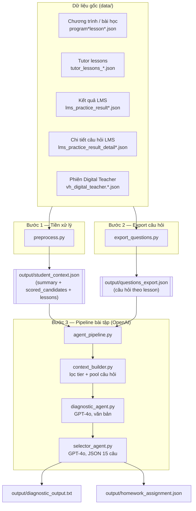

# Tài liệu tổng hợp hệ thống — Luồng xử lý dữ liệu & pipeline bài tập

**Đối tượng:** Repo `phase-0-learning-flow` — dữ liệu học tiếng Anh Phase 0 (học sinh **2102555**, nền tảng rinoedu / VH Digital Teacher).

**Mục đích tài liệu:** Mô tả **luồng xử lý từ dữ liệu thô đến bài tập cá nhân hóa**, các thành phần phần mềm và file đầu ra.

---

## 1. Tổng quan mục tiêu

Hệ thống làm ba việc chính:

1. **Thu thập / lưu trữ** các file JSON export từ LMS và MongoDB (thư mục `data/`).
2. **Tiền xử lý** để gộp, tính điểm ưu tiên, tóm tắt kỹ năng yếu → `output/student_context.json`.
3. **Trích xuất câu hỏi** theo từng bài học → `output/questions_export.json`.
4. **Pipeline agent (tùy chọn, cần OpenAI):** chọn tối đa 15 bài học ưu tiên, phân tích chẩn đoán bằng LLM, chọn đúng **15 câu** bài tập phù hợp → `output/homework_assignment.json`.

---

## 2. Sơ đồ luồng xử lý



**Thứ tự chạy lệnh (từ thư mục gốc repo):**

| Thứ tự | Lệnh | Phụ thuộc |
|--------|------|-----------|
| 1 | `python preprocess.py` | Có đủ file trong `data/` |
| 2 | `python export_questions.py` | Cùng điều kiện |
| 3 | `python agent_pipeline.py` | Có hai file `output/` ở trên + biến môi trường `OPENAI_API_KEY` |

---

## 3. Dữ liệu đầu vào (`data/`)

Các nhóm file chính (chi tiết tên file xem `CLAUDE.md`):

| Nhóm | Vai trò |
|------|---------|
| **Chương trình / bài** (`program*lesson*.json`) | Cấu trúc bài học, `lms_id`, link luyện tập. |
| **Danh sách tutor** (`tutor_lessons_*.json`) | Mỗi bài có Bài tập / Luyện tập với `lms_id` khác nhau. |
| **Kết quả LMS** | Điểm, số câu đúng, thời gian làm bài theo `practice_id`. |
| **Chi tiết câu** | `bai_lam`, `ket_qua` — dùng để biết câu sai, pattern lỗi. |
| **Digital Teacher** | Phiên học, speaking, transcript, điểm — bổ sung phân tích nói. |

Quan hệ khóa chính (rút gọn): `lesson.id` ↔ tutor lessons ↔ `erpLessonId` trong session; `lms_id` ↔ `practice_id` trong kết quả LMS.

---

## 4. `preprocess.py` — Ngữ cảnh học sinh

**Đầu ra:** `output/student_context.json`

**Cấu trúc gồm:**

- **`summary`:** Tổng hợp toàn cục (ví dụ điểm phát âm trung bình, điểm nói tự do, phân bổ loại câu trả lời, số bài theo trạng thái, kỹ năng yếu toàn cục).
- **`scored_candidates`:** Danh sách bài học đã được **xếp hạng** để agent sau dùng: `weakness_score`, `forgetting_score`, `composite_priority_score`, `days_since_last_practice`, câu hỏi làm sai, mẫu speaking kém, v.v.
- **`lessons`:** Bản ghi chi tiết theo từng bài (trạng thái hoàn thành, liên kết practice, v.v.).

Ý tưởng: gom dữ liệu rải rác thành **một JSON duy nhất** mô tả “học sinh đang ở đâu, bài nào cần ôn”.

---

## 5. `export_questions.py` — Kho câu hỏi theo bài

**Đầu ra:** `output/questions_export.json`

**Nội dung:** Theo mỗi `lesson_id`, có cấu trúc kiểu:

- **`in_class`:** pronunciation drill, free speaking, bài tương tác không audio, …
- **`homework`:** `bai_tap` / `luyen_tap` với danh sách `questions` (loại câu, nội dung, đáp án, `requires_media`, …).

Mục đích: cung cấp **nguồn câu hỏi thật** để bước sau chỉ **chọn** trong pool, không bịa câu.

---

## 6. Pipeline bài tập (`agent_pipeline.py` + `agents/`)

Chạy khi đã có `student_context.json` và `questions_export.json`. Không cần framework; dùng SDK `openai`.

### Bước 6.1 — `context_builder` (Python thuần, không gọi API)

- Đọc `scored_candidates` và file export câu hỏi.
- **Phân tầng tín hiệu** (ví dụ):
  - **critical:** `weakness_score` cao (ví dụ > 0.5),
  - **spaced_rep:** lâu không ôn (> 14 ngày) nhưng không quá yếu,
  - **maintenance:** còn lại.
- **Lọc bài:** bỏ bài có quá ít câu hỏi “dùng được” (text, không bắt buộc media), tối đa ~15 bài ưu tiên (có cơ chế đa dạng kỹ năng).
- **Ghép `question_pool`:** danh sách phẳng các câu khả dụng từ các bài đã chọn (kèm `lesson_id`, loại câu, `signal_type`, …).

→ Giảm kích thước ngữ cảnh gửi LLM so với việc ném toàn bộ export.

### Bước 6.2 — `diagnostic_agent` (GPT-4o, nhiệt độ ~0.4)

- **Đầu vào:** `summary` + danh sách bài đã tier + chi tiết câu sai / speaking.
- **Đầu ra:** Một bản phân tích **văn bản thuần** (tiếng Anh), không JSON — mô tả lỗi lặp lại, ưu tiên ôn sâu hay ôn nhẹ, gợi ý loại câu phù hợp.
- **Lưu:** `output/diagnostic_output.txt`

### Bước 6.3 — `selector_agent` (GPT-4o, nhiệt độ 0, đầu ra có schema JSON)

- **Đầu vào:** toàn bộ văn bản chẩn đoán + **`question_pool`** (chỉ được chọn trong pool này).
- **Đầu ra:** Đúng **15** mục, mỗi mục có: số thứ tự, bài, loại kỹ năng, nội dung câu, đáp án (nếu có), độ khó, lý do chọn.
- **Lưu:** `output/homework_assignment.json`

Ràng buộc thiết kế (ý định): ưu tiên critical > spaced_rep > maintenance; cân bằng speaking / grammar / vocabulary; không trùng lặp “skill coverage” theo cùng một bài (theo prompt).

---

## 7. Phụ thuộc & cách chạy nhanh

- **Python 3.10+**, gói trong `requirements.txt` (chủ yếu `openai`, `pytest` cho kiểm thử).
- Pipeline agent **bắt buộc** `OPENAI_API_KEY` trong môi trường.

```bash
python3 -m venv .venv && source .venv/bin/activate
pip install -r requirements.txt
python preprocess.py
python export_questions.py
export OPENAI_API_KEY="sk-..."
python agent_pipeline.py
```

Chạy test (không tốn API):

```bash
pytest tests/ -v
```

---

## 8. Tài liệu thiết kế chi tiết (tiếng Anh)

- `docs/plans/2026-04-21-homework-agent-design.md` — kiến trúc hai agent, schema ý định.
- `docs/plans/2026-04-21-homework-agent-pipeline.md` — kế hoạch triển khai và kiểm thử.

---

## 9. Tóm tắt một dòng

**Dữ liệu thô (`data/`) → tiền xử lý thống kê (`student_context.json`) + kho câu hỏi (`questions_export.json`) → lọc Python → chẩn đoán LLM → chọn 15 câu LLM có schema → bài tập về nhà (`homework_assignment.json`).**
